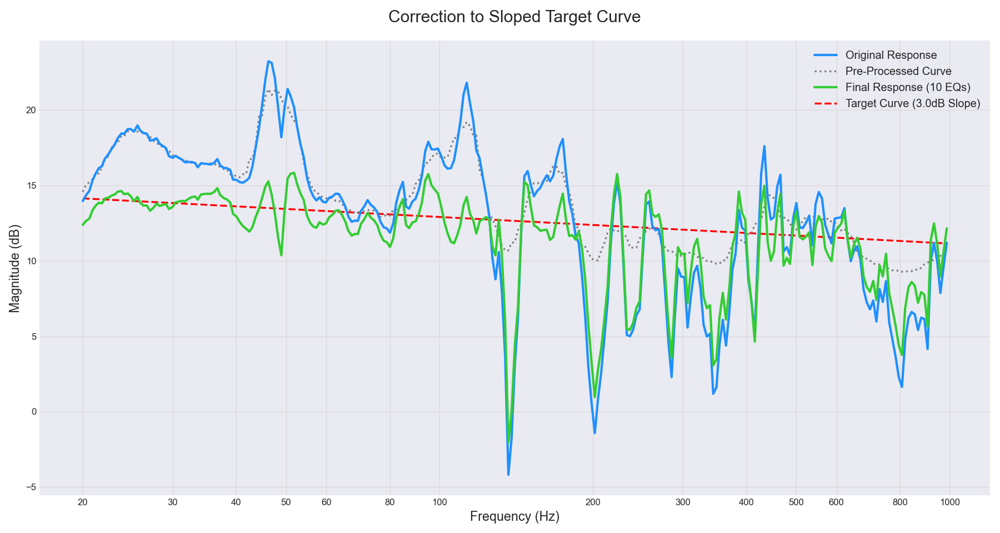

# Room Acoustic EQ Auto-Correction Algorithm

An intelligent room acoustic correction system that automatically analyzes frequency response and generates optimal equalizer parameters for audio systems.

## 🎯 Overview

This project implements an advanced automatic EQ correction algorithm designed to optimize room acoustics for audio systems. Unlike traditional flat response approaches, our algorithm uses a **tilted target curve** that considers psychoacoustic principles and real-world listening preferences.

## 📊 Results Preview



*Example of automatic EQ correction showing original response (blue), target curve (red dashed), and corrected response (green)*

## ✨ Key Features

- **Intelligent Target Curve**: Tilted frequency response (e.g., 3dB slope from 20Hz to 1kHz) for more natural sound
- **Advanced Preprocessing**: Two methods for handling problematic frequency response data
- **Configurable Smoothing**: Multiple octave-based smoothing options (1/3, 1/6, 1/12)
- **Global Optimization**: Uses simulated annealing for robust parameter optimization
- **Perceptual Weighting**: Logarithmic frequency weighting based on human auditory perception
- **Automatic Parameter Generation**: Outputs ready-to-use EQ filter parameters

## 🚀 Quick Start

### Prerequisites

```bash
pip install numpy scipy matplotlib
```

### Basic Usage

1. **Configure your settings** in the configuration section:

```python
# Basic Configuration
DATA_FILE_PATH = 'your_frequency_response.txt'
TARGET_RANGE = [1000, 8000]           # Reference frequency range (Hz)
CORRECTION_RANGE = [20, 1000]         # Correction frequency range (Hz)
NUM_EQ_BANDS = 10                     # Number of EQ filters
TARGET_SLOPE_DB = 3.0                 # Target curve slope (dB)

# Processing Options
SMOOTHING_TYPE = '1/6'                # Options: None, '1/3', '1/6', '1/12'
PREPROCESSING_METHOD = 1              # 1: Dip flattening, 2: Logarithmic correction
```

2. **Run the algorithm**:

```bash
python run_eq_analysis52.py
```

3. **Get your results**:
   - EQ parameters printed to console
   - Frequency response plot saved as PNG
   - Ready-to-use filter settings

## 🔧 Algorithm Architecture

### Core Components

#### 1. Target Curve Generation
```python
# Generate tilted target curve
log_f = np.log10(correction_freqs)
target_curve = np.interp(log_f, [log_f_20, log_f_1k], [level_at_20hz, level_at_1k])
```

#### 2. Intelligent Preprocessing

**Method 1: Dip Flattening**
```python
dip_threshold_curve = target_curve - DIP_FLATTEN_THRESHOLD_DB
deep_dip_mask = analysis_mags < dip_threshold_curve
analysis_mags[deep_dip_mask] = target_curve[deep_dip_mask]
```

**Method 2: Logarithmic Correction**
```python
negative_mask = analysis_mags - target_curve < 0
analysis_mags[negative_mask] = target_curve[negative_mask] - np.log2(1 + target_curve[negative_mask] - analysis_mags[negative_mask])
```

#### 3. Octave-Based Smoothing
```python
def smooth_curve(freqs, mags, smoothing_type):
    fractions = {'1/3': 3, '1/6': 6, '1/12': 12}
    # Gaussian-weighted averaging within octave bands
    weights = np.exp(-((np.log2(freqs[mask]/center_freq))**2))
    smoothed_mags[i] = np.average(mags[mask], weights=weights)
```

#### 4. Global Optimization
```python
def cost_function(params, original_mags, target_curve, freq_axis, fs, log_freq_weights):
    eq_curve_db = get_combined_eq_curve(params, freq_axis, fs)
    corrected_mags = original_mags + eq_curve_db
    squared_errors = (corrected_mags - target_curve)**2
    weighted_squared_errors = squared_errors * log_freq_weights
    return np.sqrt(np.mean(weighted_squared_errors))
```

## 📊 Processing Pipeline

1. **Data Import**: Load frequency response measurements
2. **Reference Calculation**: Compute average level in target range (1-8kHz)
3. **Target Curve Generation**: Create tilted reference curve
4. **Preprocessing**: Apply selected correction method
5. **Smoothing**: Apply octave-based smoothing for initial guess
6. **Optimization**: Global optimization using preprocessed (non-smoothed) data
7. **Output**: Generate EQ parameters and visualization

## 🎛️ Configuration Options

### Smoothing Types
- `None`: No smoothing applied
- `'1/3'`: 1/3 octave smoothing
- `'1/6'`: 1/6 octave smoothing  
- `'1/12'`: 1/12 octave smoothing

### Preprocessing Methods
- `1`: **Dip Flattening** - Clips deep notches to prevent over-correction
- `2`: **Logarithmic Correction** - Smooth handling of negative deviations

### Output Files
Files are automatically named based on configuration:
- `frequency_response_sloped_1-6_dip_flatten.png`
- `frequency_response_sloped_1-3_log_correction.png`

## 📈 Technical Highlights

### Perceptual Weighting
The algorithm uses logarithmic frequency weighting to match human auditory perception:

```python
log_freqs = np.log10(correction_freqs)
log_freq_widths = np.diff(mid_points, prepend=mid_points[0], append=mid_points[-1])
```

### Parameter Constraints
- **Frequency ordering**: Center frequencies must be strictly increasing
- **Gain limits**: -30dB to +8dB range for practical applications
- **Q factor range**: 0.4 to 8.0 for usable filter characteristics

### Dual-Stage Processing
- **Initial guess**: Uses smoothed data for stability
- **Final optimization**: Uses preprocessed original data for detail preservation

## 🎵 Why Tilted Target Curves?

Traditional flat response correction often sounds unnatural because:

1. **Psychoacoustics**: Human hearing perceives slightly tilted curves as more balanced
2. **Room acoustics**: Most rooms naturally boost low frequencies
3. **Musical preference**: Slight low-frequency emphasis creates "warmth"
4. **Listening fatigue**: Perfectly flat response can sound harsh over time

## 📋 Input Data Format

Your frequency response file should contain:
```
Frequency	Magnitude
20.0	-2.5
25.0	-1.8
...
```

## 🔬 Algorithm Performance

- **Convergence**: Typically converges within 1500 iterations
- **Parameter quality**: All generated parameters within practical ranges
- **Listening experience**: More natural sound compared to flat response
- **Adaptability**: Handles various room acoustic problems

## 🛠️ Advanced Usage

### Custom Target Curves
```python
# Modify target slope for different preferences
TARGET_SLOPE_DB = 2.0  # Gentler slope
TARGET_SLOPE_DB = 5.0  # More pronounced slope
```

### Adaptive Filter Count
```python
# Adjust based on room complexity
NUM_EQ_BANDS = 6   # Simple rooms
NUM_EQ_BANDS = 15  # Complex acoustic environments
```

## 📚 Scientific Background

This algorithm is based on:
- **Psychoacoustic research** on preferred listening curves
- **Room acoustic theory** for realistic correction limits
- **Numerical optimization** techniques for robust parameter finding
- **Digital signal processing** for accurate filter implementation

## 🤝 Contributing

We welcome contributions! Areas for improvement:
- Adaptive filter count algorithms
- Full-range frequency correction
- Real-time processing capabilities
- Machine learning integration

## 📄 License

This project is open source. Feel free to use, modify, and distribute according to your needs.

## 🔗 Related Projects

- Room measurement software
- Audio analysis tools
- Digital signal processing libraries

## 📞 Contact

For questions, suggestions, or collaboration opportunities, please open an issue or reach out through the repository.

---

**Keywords**: Room Acoustics, EQ Correction, Audio Processing, Digital Signal Processing, Psychoacoustics, HiFi

**Technologies**: Python, NumPy, SciPy, Matplotlib, Signal Processing, Optimization Algorithms 
